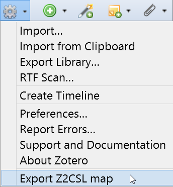

# z2csl - Zotero to CSL extension and mappings

This is a Zotero extension which creates up-to-date mappings from Zotero to CSL. Moreover, the current version of the mappings is hosted at  :point_right: **https://aurimasv.github.io/z2csl/typeMap.xml** :point_left: .

## Mappings

The mappings are in xml format and work with [typeMap.xsl](typeMap.xsl) and [typeMap.css](typeMap.css) files to create a [human-readable page](https://aurimasv.github.io/z2csl/typeMap.xml).

### XML Format

The [typeMap.xml](typeMap.xml) has several top-level nodes: Some metadata about the generation is saved in `zoteroVersion` and `date`; `zTypes` list the fields for each Zotero type; the actual mapping between Zotero fields and CSL fields is saved in `cslFieldMap` and `cslCreaterMap` with additions from `citeProcJStoCSLmap`; and `cslVars` lists all CSL variables with descriptions.
 
See also [this diagram](doc/z2csl.svg).

## Extension

This Zotero extension adds an option to the Zotero Actions (gear) menu to export item and field mappings from Zotero to Citation Style Language (CSL).

